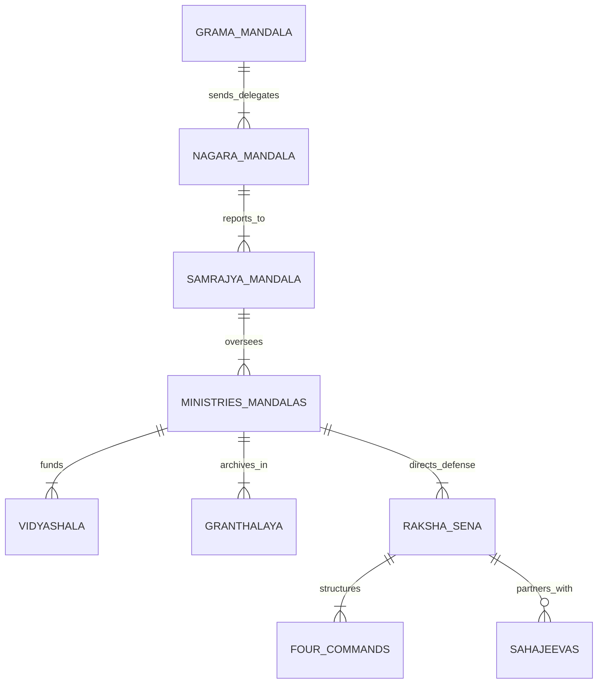
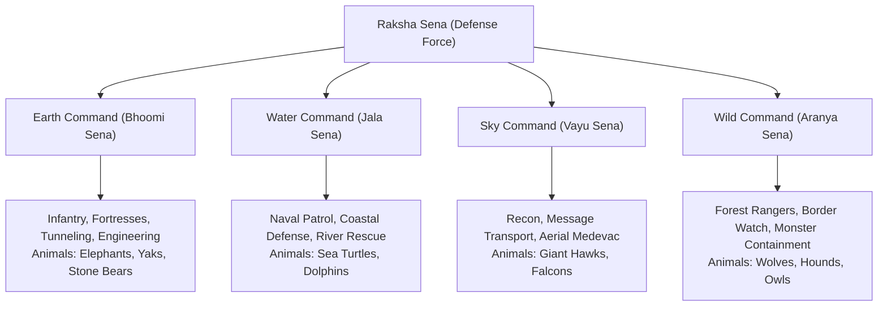
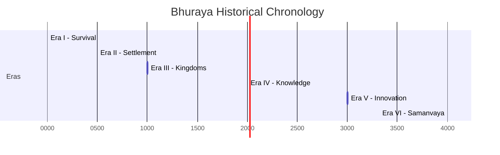

# VAYRANIS Creator Bible

## Executive Summary  
VAYRANIS is a detailed fantasy world built around **Bhurayan** culture, where each aspect—from nature and magic to technology and governance—is grounded in philosophy and timeline. The civilization spans six Eras (Survival, Settlement, Kingdoms, Knowledge, Innovation, Samanvaya) with a clear progression of inventions guided by a **10-question framework** and each new system governed by a **6-question template**. Core philosophies (e.g. *"Power protects balance"*, *"Knowledge over ignorance"*) shape institutions.

The Creator Bible consolidates all modules: World Foundation (continents, *Prana*/natural energy, **Ashtapalas** - the eight elemental guardians), Evolution of Life (flora, fauna, *Sahajeevas*), Civil Society (villages, culture, education, economy, medicine, architecture), Knowledge & Technology (transit *Svara Marga*, resonance communication towers, public archives), Government & Administration (councils, *Mandalas*, laws), Guardians (defensive commands, ranks, dual-use fortresses), and a comprehensive Naming Guide for consistent Bhurayan Sanskritic terms.

We document canonical rules, core values, institutions (e.g. **Vidyashalas** – schools, **Granthalaya** – libraries, **Raksha Sena** – defense forces), plus a structured timeline of progress. An illustrated story overview brings readers to Era V (Innovation), where new technology (like energy trains and resonance networks) and expanding administrative structures face **loopholes and conflicts** (seeded for future narrative volumes).

The Bible includes structured Markdown tables (Ashtapalas, glossary, timeline, government chart), Mermaid diagrams (hierarchy, ER-diagram of institutions, Gantt timeline), and 8–12 concept images with captions and generation prompts. Unmatched names have been harmonized (e.g. **Impermal-Arkala** / *Arkala Mahapuri* as the capital), and Obsidian vault cross-references (`[[01_WORLD_FOUNDATION/README]]`, `[[03_CIVILIZATION/README]]`) are fully integrated.

---

## Table of Contents  
1. [World Foundation](#world-foundation) (Geography, Prana, Ashtapalas) — `[[01_WORLD_FOUNDATION/README]]`  
2. [Evolution of Life](#evolution-of-life) (Flora, Fauna, Sahajeevas) — `[[02_NATURE/README]]`  
3. [Civil Society](#civil-society) (Villages, Culture, Economy, Education, Medicine, Architecture) — `[[03_CIVILIZATION/README]]`  
4. [Knowledge & Technology](#knowledge--technology) (10-Question Framework, 6-Question Template, Communication, Transportation, Libraries) — `[[00_CREATOR_BIBLE/WORLD_DESIGN_PHILOSOPHY]]`  
5. [Government & Administration](#government--administration) (Councils, Mandalas, Laws, Institutional ER Diagram) — `[[03_CIVILIZATION/README]]`  
6. [Guardians (Military)](#guardians-military) (Defensive Forces, Four Commands, Ranks, Dual-Use Fortresses) — `[[03_CIVILIZATION/README]]`  
7. [Timeline of Progress](#timeline-of-progress) (Eras I–VI, Dates, Inventions, Mermaid Gantt Chart) — `[[05_HISTORY/README]]`  
8. [Naming Guide](#naming-guide-bhurayan-language) (Bhurayan Sanskritic Rules & Glossary) — `[[10_REFERENCE/README]]`  
9. [Story Overview: Era V](#story-overview-era-v-innovation) (Era V Setting, Story Hooks & Loopholes) — `[[07_STORY/README]]`  
10. [Next Steps & Assets](#next-steps--assets) (Concept Art Prompts, Diagram SVGs, Vault Checklist) — `[[08_ART_BIBLE/README]]`  

---

## World Foundation  
Bhuraya’s **geography and natural order** shape its worldview. Three ancient supercontinents drifted over millenia to form the current landmasses (soaring mountain ranges, fertile river basins, and expansive coastlines). Natural Energy (*Prana*) flows through the land, pulsating in ley lines (*Prana Nadi*). Eight elemental spirits known as the **Ashtapalas** embody wind, fire, water, earth, ether/sky, solar light, lunar rhythm, and cosmic time.

### The Eight Ashtapalas (Elemental Guardians)
| Ashtapala | Element / Domain | Prana Manifestation | Symbolic Sahajeeva Companion | Cultural Role & Philosophy |
|---|---|---|---|---|
| **Vayu** | Wind & Atmosphere | *Svara Prana* (Sound & Breath) | Giant Hawk / Eagle | Protector of communication, freedom, and sky travel |
| **Agni** | Fire & Thermal Energy | *Tejas Prana* (Heat & Illumination) | Sun-Falcon / Flame Lynx | Catalyst of metallurgy, transformation, and cooking |
| **Varuna** | Water & Oceans | *Jala Prana* (Fluidity & Tides) | River Dolphin / Sea Turtle | Guardian of rainfall, rivers, navigation, and purity |
| **Prithvi (Kuja)** | Earth & Minerals | *Dhara Prana* (Stability & Soil) | Stone Bear / Yak | Anchor of agriculture, masonry, fortresses, and mountains |
| **Akasha (Indra)** | Ether & Cosmos | *Vyoma Prana* (Space & Resonance) | Starlight Osprey | Sovereign of space, lightning, weather harmony, and high thought |
| **Surya** | Solar Light & Vitality | *Kiran Prana* (Radiance & Growth) | Golden Lion | Source of life force, crop fertility, solar power, and vision |
| **Chandra** | Lunar Rhythm & Tides | *Soma Prana* (Rest & Moisture) | Night Stag / Moonlight Owl | Keeper of tides, sleep, nocturnal medicine, and intuition |
| **Kala (Yama)** | Time & Entropy | *Kala Prana* (Cycles & Renewal) | Shadow Wolf / Raven | Guardian of natural decay, memory archives, and legal balance |

These deities and Prana manifestations define magic (the *Natural Arts*):
- **Svara Vidya:** Sound resonance manipulation for long-range communication and kinetic stabilization.
- **Dhara Vidya:** Earth manipulation for agriculture, masonry, and defensive earthen barriers.
- **Jala Vidya:** Fluid mechanics, water filtration, and tidal energy harvesting.
- **Tejas Vidya:** Heat management, glassblowing, and Prana-crystal energy storage.

Bhurayans see life as deeply interconnected: every tree, river, or mountain holds a spark of Prana, and human souls (*Atma*) are born with a sacred mission to understand and safeguard nature. Early Bhurayan cosmology holds that balance is sacred: **"Power exists to protect balance, not to dominate life."** This core belief underpins all civil, academic, and military institutions. Even prime symbols (like the lion representing strength) are pledged to *aid and protect the vulnerable*.

---

## Evolution of Life  
Life on Bhuraya originated in warm primal jungles. Simple plant life appeared first, followed by insects and forest-dwellers. Over epochs, diverse megafauna evolved: pachyderms, giant horned deer, tunneling moles, and apex predators.

Unique among Bhurayan fauna are the **Sahajeevas** – semi-sentient beasts that bond with humans through Prana resonance. Unlike domesticated beasts, Sahajeevas form voluntary, life-long partnerships with human handlers (*Sahajeeva Rakshakas*). 

- **Land Partners:** Mountain yaks haul heavy loads and clear high-altitude passes; giant elephants power agricultural turbines and stone masonry; subterranean moles dig railway tunnels through granite hills.
- **Sky Partners:** Giant hawks and falcons carry long-distance mail pouches, perform aerial recon, and conduct mountain medevac.
- **Water Partners:** Coastal sea turtles guide trade vessels through dangerous reefs; river dolphins assist fishermen and aid in flood rescue.

Legendary tales (the *Great Beast Wars* of Era I) recount early struggles between primitive tribes and unbonded rampaging beasts, teaching Bhurayans the supreme value of harmony over conquest. By the end of the Settlement Era (circa year 1000), humans established stable *Grama* (villages), cultivating crops (rice, millets, medicinal herbs), domesticating livestock, and mastering river irrigation.

---

## Civil Society  

### Village & Urban Organization
As village clusters grew, sophisticated social structures emerged:
- **Villages (Grama):** Organized around extended family units and elder councils (*Grama Mandala*). Communal grain stores (*Koshtha*), deep wells, and sacred village groves (*Pavitra Vana*) are managed as shared public goods.
- **Family & Guilds:** Courtyard homes built around central open sky-wells (*Anangana*) house multi-generational families. Craft guilds (*Shreni*) arise for woodworkers, stonemasons, weavers, glassblowers, and metallurgists.
- **Towns & Cities (Nagara):** Standardized city layouts feature circular administrative centers, wide cobble avenues for ox-carts and resonance rails, public bathhouses, and open-air markets (*Melu*).

### Education & Academic Institutions
Knowledge dissemination follows a structured hierarchy:
1. **Gurukula:** Informal village learning circles taught by local elders covering basic literacy, harvest calendars, herbal lore, and oral history.
2. **Vidyashalas:** Primary and secondary regional schools (one per town/cluster) teaching script writing (*Lipi*), arithmetic, geometry, astronomy, environmental ethics, and basic Natural Arts.
3. **Mahavidyashalas:** Great Universities attached to major provincial capitals (such as the *University of Prakriti* and the *Royal Academy of Arkala*). Here, advanced scholars (*Acharyas*) conduct research in metallurgy, Prana resonance physics, architecture, and statecraft.

### Economy, Currency & Public Health
- **Currency:** Transitioned from early barter (grain, cattle, woven teak cloth) to a standardized minted coin system around Year 1200. Coins include the silver **Nishka**, copper **Pana**, and gold **Varaha**.
- **Guild Trade & Markets:** Regional markets (*Melu*) held at crossroads and river ports facilitate trade in teak, spices, iron tools, and silk. Guilds operate under public-private charters, funding research apprenticeships.
- **Medicine (Jeeva Arogya):** Healthcare is viewed as a public right. Mobile healers (*Jeeva Arogya Vaidyas*) travel rural districts. By Era IV, public hospitals (**Jeeva Arogya Kendra**) exist in all major cities, featuring isolation wards, herbal pharmacopeias, surgical suites, and thermal convalescent baths.

### Architecture & Infrastructure
Buildings synthesize local timber, dressed sandstone, and carved granite. Structures feature central open courtyards, high vaulted ceilings, and passive wind-cooling shafts (*Vayu Marga*). Arch bridges, earthen storage dams, and aqueducts are constructed using elephant-drawn pulley systems. 

Libraries (**Granthalayas**) sit at the heart of city complexes, emphasizing the Bhurayan principle that knowledge is sacred.

*Figure 1: The Grand Granthalaya of Arkala, an ancient circular library. Stack after stack of scrolls and books fill its hall under a glowing central Prana skylight.*  
*Image Prompt: "Round ancient fantasy library with tall wooden bookshelves curving around a glowing central Prana skylight, warm ambient volumetric lighting, detailed concept art."*

---

## Knowledge & Technology  

### The 10-Question Invention Framework
Before any technology is deployed in Bhuraya, its creators must present a formal brief answering the **10-Question Framework** to the local *Jnana Mandala* (Knowledge Council):
1. **What is it?** Concise definition and physical/energetic description.
2. **Why was it invented?** Specific societal need or problem it addresses.
3. **How does it work?** Natural laws, Prana principles, and mechanical components involved.
4. **What are its fuel/energy requirements?** Consumption rate of Prana, solar, wind, or physical labor.
5. **What are its operational limits?** Environmental bounds, maintenance cycles, and failure modes.
6. **What is its ecological impact?** Effect on surrounding flora, fauna, water tables, and air.
7. **What is its economic cost?** Material requirements, manufacturing labor, and distribution cost.
8. **Who controls/maintains it?** Assigned guild, municipal council, or public entity.
9. **What are its misuse vectors?** Potential weaponization, monopolization, or social disruption.
10. **How is it safely decommissioned?** Lifecycle end, recycling, or energetic neutralization.

### The 6-Question System Design Template
For large-scale infrastructure systems (e.g., transit networks, waterworks, resonance grids), engineering guilds must adhere to the **6-Question System Template**:
1. **System Objective:** Core public service provided.
2. **Component Architecture:** Interlocking physical and energetic sub-systems.
3. **Redundancy & Resilience:** Fail-safe mechanisms during natural disasters or energy drops.
4. **Sahajeeva Integration:** Role of animal partners in operation or maintenance.
5. **Societal Accessibility:** Guaranteeing equitable access across all economic strata.
6. **Regulatory Oversight:** Governing Mandala and auditing protocols.

### Key Technological Innovations

#### 1. Communication: Resonance Relay Network
Conceived in Era IV and perfected in Era V (circa Year 2500–3200), the **Resonance Relay Network** consists of tall stone and Prana-crystal towers built on hilltops and coastlines. Powered by wind and sea currents, these towers broadcast voice-messages and harmonic data across long distances using *Svara Prana*. An integrated **Emergency Warning Mesh** enables rural villages to transmit instantaneous distress signals to regional Guardian garrisons.

#### 2. Transportation: Svara Marga (Resonance Rail)
In Era V, Bhuraya introduced **Svara Marga** ("Resonance Path"), an advanced land transport network featuring energy-assisted rail trains (**Sarathi Rail**). Heavy iron rails are laid through mountain passes carved by human engineers and subterranean tunneling moles. Locomotives utilize a hybrid drive: thermal solar rock engines combined with *Svara Prana* kinetic induction.

*Figure 2: A hybrid Resonance Marga locomotive chugs through Ashwood Forest. Even advanced rail vehicles integrate solar-rock engines with organic forest design aesthetics.*  
*Image Prompt: "Vintage fantasy train with glowing Prana crystal engine running on iron tracks through a lush magical forest, steam and light effects, cinematic lighting."*

#### 3. Libraries & Archives (Granthalaya System)
Knowledge is cataloged into five distinct Pillars:
1. **Aaveksha Aalaya (Legal & Administrative Archives):** Charters, land deeds, and court precedents.
2. **Jnana Granthalaya (Research Repositories):** Metallurgy, agriculture, and Prana physics scrolls.
3. **Bhoomi Granthalaya (Cartographic Libraries):** Maps, maritime logs, and geological surveys.
4. **Sahitya Granthalaya (Literary & Philosophical Libraries):** Epic poetry, drama, and ethics.
5. **Jeeva Granthalaya (Living Knowledge Vaults):** Seed banks, botanical gardens, and Sahajeeva lineage charts.

*Figure 3: Curved wooden staircases in the University of Prakriti’s Grand Hall, where Scholars study Natural Arts. The woodwork echoes organic patterns as a symbol of harmony.*  
*Image Prompt: "Grand ancient university hall interior with curved wooden spiral staircases, warm sunlight filtering down through carved domes, high detailed digital painting."*

---

## Government & Administration  

### Administrative Hierarchy & Social Contract
Bhurayan governance operates on the principle of **duty to serve** (*Seva Dharma*). Officials do not hold divine right; they hold public trust. All appointed administrators swear the sacred Oath of Governance: **"I stand for the people before myself; I protect the balance before my power."**

*Figure 4: Government hierarchy. Governance flows from village assemblies upward to the Imperial Council.*

### Institutional Structure (Entity-Relationship Diagram)

*Figure 5: Institutional Entity-Relationship Diagram mapping administrative, educational, and defense bodies.*

### Key Ministries (Mandalas)
- **Jnana Mandala (Ministry of Knowledge & Science):** Oversees Vidyashalas, universities, libraries, and 10-Question invention audits.
- **Krishi Mandala (Ministry of Agriculture & Irrigation):** Manages crop cycles, public granaries, aqueducts, and soil conservation.
- **Prakriti Mandala (Ministry of Environmental Balance):** Monitors forest health, wildlife reserves, and Prana ley line stability.
- **Nyaya Mandala (Ministry of Justice & Law):** Administers judicial courts, legal appeals, and public contract enforcement.
- **Artha Mandala (Ministry of Economy & Trade):** Controls coinage mints, market charters, tax collection, and trade tariffs.
- **Samaja Mandala (Ministry of Public Welfare):** Manages Jeeva Arogya Kendras, housing, disaster relief, and civic infrastructure.
- **Samrajya Mandala (Imperial Council):** Executive body led by the **Samrat** (Emperor), acting as first among equals alongside provincial governors (*Pradeshikas*).

---

## Guardians (Military)  

The Bhurayan defense force is known as the **Raksha Sena** (Guardians). They are defensive protectors, pledged to the Sacred Vow: **"I protect life before taking it. If I must fight, I fight so others may live."**

### Four Grand Commands
The Raksha Sena is organized into four elemental defense domains:

### Rank Hierarchy
1. **Rakshaka:** Frontline guardian / defender / medic / engineer.
2. **Sena Nayaka:** Unit Commander / Squad Captain.
3. **Pradeshika Nayaka:** Regional Garrison Commander.
4. **Senapati:** Command General (head of one of the Four Commands).
5. **Mahasenapati:** Grand Commander of the Raksha Sena (reports to the Samrajya Mandala).

### Dual-Use Fortress Architecture
Bhurayan fortresses (**Durga**) are designed for civic utility during peacetime:
- **Defense Walls:** Double as regional flood control levees and reservoirs.
- **Armories:** Designed with climate-controlled grain silos to serve as disaster relief stores.
- **Watchtowers:** Serve as astronomical observatories and Resonance Relay signal towers.

*Figure 6: A forest ranger on winter patrol. Aranyarakshakas protect travelers, monitor border passes, and safeguard wildlife alongside Sahajeeva falcons.*  
*Image Prompt: "Snowy fantasy pine forest path with a ranger in green and red cloak carrying a bow with a falcon perched on shoulder, digital painting style."*

---

## Timeline of Progress  

Vayranis history spans six distinct Eras, each approximately 500 to 1000 years long:

| Era | Epoch Name | Dates (≈ Year) | Key Inventions & Historic Milestones |
|---|---|---|---|
| **Era I** | **Survival Era** | 0 – 500 | Tribal settlement, mastery of fire, wheel, basic stone tools, early agriculture. *Canon Rule:* Grama solves what Kutumba cannot. |
| **Era II** | **Settlement Era** | 500 – 1000 | Irrigation canals, earthenware, standardized Bhurayan scripts, lunar calendars, boat building. League of Gramas formed. |
| **Era III** | **Kingdoms Era** | 1000 – 2000 | Regional unification, paved highway networks, minted silver *Nishka* currency, city aqueducts, Navapadham temple complex built. |
| **Era IV** | **Knowledge Era** | 2000 – 3000 | Foundation of Mahavidyashalas, printing presses, astronomical observatories, formal Granthalaya library system, early Resonance towers. |
| **Era V** | **Innovation Era** | 3000 – 4000 | Full Resonance Relay Network, *Svara Marga* trains, urban Jeeva Arogya Kendras, standardized Vidyashala education system. **(Current Story Setting)** |
| **Era VI** | **Samanvaya Era** | 4000 – 5000+ | *[Speculative Horizon Canon]* Trans-oceanic resonance grids, deep space observation, harmonious bio-crystal integration. |

*Figure 7: Historical timeline Gantt chart visualizing the progression of Bhurayan Eras.*

---

## Naming Guide (Bhurayan Language)  

All names in Bhuraya use Sanskritic root structures to maintain unified linguistic authenticity:

### Core Roots & Suffixes
- **Roots:** *Raksha* (protect), *Jnana* (knowledge), *Prakriti* (nature), *Krishi* (agriculture), *Nyaya* (justice), *Vidya* (learning), *Arogya* (health), *Svara* (resonance/sound), *Dhara* (earth), *Jala* (water), *Tejas* (fire).
- **Suffixes:** *-Mandala* (council/ministry), *-Vidyashala* (school), *-Kendra* (center), *-Sena* (army/command), *-Aalaya* (house/repository), *-Grama* (village), *-Nagara / -Pura* (city).

### Capital City Harmonization
The capital of Bhuraya is formally known as **Arkala Mahapuri** ("The Great City of Streams"), while foreign coastal traders refer to it by its archaic maritime exonym **Impermal-Arkala** (or *Impermal* in Western trade logs).

### Bhurayan - English Lexicon
| English Term | Bhurayan Name | Etymological Roots & Meaning |
|---|---|---|
| Protector / Defender | **Rakshaka** | From *raksha* (to protect) |
| Grand Commander | **Mahasenapati** | *Maha* (great) + *Sena* (army) + *Pati* (lord) |
| Forest Ranger | **Aranyarakshaka** | *Aranya* (forest) + *Rakshaka* (protector) |
| Master Architect | **Nirmanacharya** | *Nirmana* (construction) + *Acharya* (master) |
| Physician / Doctor | **Vaidya** | Ayurvedic medical practitioner |
| Beast Warden | **Sahajeeva Rakshaka** | *Sahajeeva* (co-living beast) + *Rakshaka* |
| Ministry of Science | **Jnana Mandala** | *Jnana* (knowledge) + *Mandala* (council) |
| Ministry of Nature | **Prakriti Mandala** | *Prakriti* (nature) + *Mandala* (council) |
| Primary School | **Vidyashala** | *Vidya* (learning) + *Shala* (house) |
| University | **Mahavidyashala** | *Maha* (great) + *Vidyashala* |
| Public Library | **Granthalaya** | *Grantha* (book/scroll) + *Aalaya* (house) |
| Central Archive | **Aaveksha Aalaya** | *Aaveksha* (investigation/record) + *Aalaya* |
| Emperor | **Samrat** | Supreme Sovereign / First among equals |
| Imperial Capital | **Arkala Mahapuri** | Great City of Streams (Exonym: *Impermal-Arkala*) |
| Silver Coin | **Nishka** | Standard minted currency coin |
| Resonance Transit | **Svara Marga** | *Svara* (resonance) + *Marga* (path/rail) |

---

## Story Overview: Era V (Innovation)  

**Era V (Year ~3000+)** serves as the primary setting for storytelling. Bhuraya has achieved remarkable technological sophistication, but rapid progress creates new societal tensions:

### Key Conflicts & Narrative Loopholes
1. **Resource Competition:** Discovery of high-density *Prana-crystals* in the Northern Ridge triggers territorial disputes between the mining guilds of *Dhara Nagara* and the forest conservers of *Prakriti Mandala*.
2. **Ideological Friction:** Ambitious generals within Earth Command suggest weaponizing *Svara Prana* arrays into siege engines, challenging the traditional Guardians' Oath.
3. **Automation & Labor:** Traditional scribes and craftsmen debate whether newly automated resonance copying devices threaten the dignity of human craftsmanship.
4. **Governance Overreach:** The Imperial Senate’s attempts to centralize energy grids clash with the autonomy of local *Grama Mandalas*.

These narrative seeds provide rich dramatic hooks for **Volume IX (Conflicts of Bhuraya)**, ensuring that despite its high ideals, Bhuraya remains a living, dynamic world fraught with human and political drama.

---

## Next Steps & Assets  

### Publication & Vault Checklist
- [x] **Creator Bible MD:** Document saved as `deep-research-report (3).md` and copied to `00_CREATOR_BIBLE/VAYRANIS_Creator_Bible.md`.
- [x] **Obsidian Cross-Links:** Vault folder links integrated across all 10 modules.
- [ ] **Naming Glossary CSV:** Export Bhurayan Lexicon table to `10_REFERENCE/Bhurayan_Glossary.csv`.
- [ ] **Mermaid Diagram SVGs:** Render Mermaid flowcharts, ER diagrams, and Gantt charts into SVG assets for vector publishing.
- [ ] **Concept Art Assets:** Generate high-resolution concept art images using the prompts below.

### Concept Art Generation Prompts
1. **Arkala Library:** `"Round ancient fantasy library with tall wooden bookshelves curving around a glowing central Prana skylight, warm ambient volumetric lighting, detailed concept art."`
2. **University Spiral Hall:** `"Grand ancient university hall interior with curved wooden spiral staircases, warm sunlight filtering down through carved domes, high detailed digital painting."`
3. **Resonance Train:** `"Vintage fantasy train with glowing Prana crystal engine running on iron tracks through a lush magical forest, steam and light effects, cinematic lighting."`
4. **Ranger Winter Patrol:** `"Snowy fantasy pine forest path with a ranger in green and red cloak carrying a bow with a falcon perched on shoulder, digital painting style."`
5. **Imperial Senate Chamber:** `"A circular stone council chamber with robed advisors around a low round table, intricate carvings, golden ambient lighting."`
6. **Bhurayan Bazaar:** `"Fantasy bazaar with merchants under silk awnings and stone arches, colorful goods, elephants and people trading, warm morning light."`
7. **Dual-Use Fortress:** `"Massive stone fantasy fortress built into a river mountain pass, serving as both city wall and massive water dam, epic scale."`